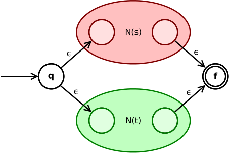

# DefferedGraphTheory 2021
# G00371316

# Project Brief
Write a program in Python 3 that takes a regular expression and a file as command line arguments, and outputs the number of matches for the regular expression within the file. You may limit yourself to regular languages, with the concatenation operator ., the or operator |, and the Kleene star *. The program should work as follows:

# Instructions to start Program
Open windows terminal to the correct pathway and open in VS code.

Enter regular expression as the first command.

Enter the filepath as the second command.

If user requires help, enter "--help" or "-h".  Instructions would then be provided.

User should enter "python3 rescript.py cab input.txt" "cab" being the regular expression to find and "input.txt" being the filepath with a list of words. "cab" can be replaced by any word the user wants

Depending on the input, user should get a number result when program is compiled.

# 1.	Explain the difference between regular expressions in infix notation and those in postfix notation.
There is a slight a difference between Infix and Postfix notation.  Both of them use operands and operators, although they do not use them in the same order which may make it unusual for individuals to read postfix notation.  Jan Lukasiewicz invented the postfix notation which is also known as “Reverse Polish notation” in 1924.  RPN is a fantastic way to simply evaluate an expression using a stack.  

For example, infix notation has an <operand> <operator> <operand> (4 + 5).  Infix would be a lot friendlier to the human eye as with the modern age we have always done calculations in this format.  Postfix notation which is also called Reverse Polish Notation formats operands and operators slightly different.  The operator comes after the operands; <operand><operand><operator> (4 5 +).  As you can see that postfix is a lot easier for machines to read, postfix notation is a lot more efficient for the computer to understand.  Postfix notations makes it easier to complete equations for computers.  
 
Another difference between the two notations is that infix uses and relies on parentheses.  The equation would incorrect if the parentheses were ignored.  Whereas postfix does not require any parentheses if every operator has the exact number of operands.  
 
Using the “shuntingre.py” file we created in the labs I can prove that parentheses are needed in infix.  In this algorithm we change infix to postfix using regular expressions, I entered “(a.(b.b)*.a” the outcome was “abb.*.a.” And without the brackets the answer was “ab.b*.a.”  As seen from this answer that the two notations work differently with the parentheses are included or not included.
 
In conclusion, infix is better and easier for humans to read and carry out expressions, although postfix is the methodical process for computers to carry out expressions at their optimal level. From the points I have raised explains the differences in infix and postfix using regular expressions. 
 
# Resources got from:
 
 shuntingre.py lab
 
 https://www.youtube.com/watch?v=jos1Flt21is
 
 https://en.wikipedia.org/wiki/Reverse_Polish_notation
 
 https://en.wikipedia.org/wiki/Infix_notation#:~:text=Infix%20notation%20is%20the%20notation,plus%20sign%20in%202%20%2B%202.
 

# 2.	Explain how Thompson's construction for regular expressions works.
Thompson’s constructor, also known as McNaughton-Yamada is an algorithm which takes regular expressions and transforms them into an equivalent NFA (nondeterministic finite automaton) or an epsilon NFA.  This will then by recognised by the computer as patterns of text, this algorithm was invented by Ken Thompson in the 1960s. 

I will clarify what regular expressions and NFAs are, first of all, they are both formal languages.  And this algorithm will assist NFA’s to recognise the same language as the regular expression it is compared with.  Regular expressions are used to represented certain sets of strings in an algebraic way, NFAs are used for execution purposes in computing, especially when using regular expressions.

There are three basics concepts for operators and regular expressions which you need to know to understand Thompson’s constructor.  The basic operators are “.”, “|” and “*”.  I will give examples of these now.

•	“.” means concatenate, “a.b” means “a” followed by “b”.  
•	“|” means or, “a|b” means “a” or “b”.  
•	“*” means zero or more times, “a*” means zero or more “a’s”

When adding states, there will always be one state called initial and the other state is called final.  Nothing points at the start state except for the initial arrow, the basics you need to know for Thompson’s constructor is the transition, where you start, and the accept states, which is always a single accept state. Here are a few examples of turning a regular expression into an NFA. 

 
The concatenation state “.”.  “s.t” means “s” beside “t” so the final state cannot be reached without “s” and “t” being beside one another.
 
 
 
This is the union state “|”, the expression used is “s|t”.  As you can see “s” goes one way and “t” goes another because this means “s” or “t” which then reaches its final state once either of these are found.

 
This is the Kleene star/ closure, this means 0 or more.  “q” is the initial state and “f” is the final state for all these diagrams.  This set will be {Ε, s, ss, sss ….} as it can be empty or have repetition.

From this example you can see that this is the NFA for the regular expression (a|b)* abb using the Thompson constructor algorithm, all previous examples also used the same algorithm.  To find out if its correct, you would match this piece of text (Regular Expression) to the pattern that is shown and as seen in the diagram it does.  This shows the pattern matching which we are trying to prove.

# Resources got from: 

https://en.wikipedia.org/wiki/Thompson%27s_construction

https://www.youtube.com/watch?v=k-84q1vx-_I
                    
https://web.microsoftstream.com/video/d6d9a2d8-b23e-4abf-b1b7-af3a2d44b82f?referrer=https://learnonline.gmit.ie/
                    
                    
# 3.	Explain what is meant by the term irregular language in the context of regular expressions.
First of all, we will need to know what a regular expression is to answer this question.  A regular expression is a continuation of characters that identifies a search pattern.  It is a tool used in many apps and websites throughout the internet.  This tool is called a “find” or “find and replace”, you can usually get this through “crtl+f” on your keyboard.

An irregular/ non-regular language is a language that cannot be defined by regular expression and this is the opposite for regular languages.  Regular languages are also known as rational language.  Regular expressions use regular languages only as that is how they are programmed.  Although with enhanced software some features will allow regular expressions to accept non-regular languages.  Another difference between regular language and irregular, is that irregular cannot be recognized as a finite automaton.  Whereas a regular language can.

There is a way to prove whether a certain character/s is part of a regular language or a non-regular language, this is done by the “Pumping lemma”.  The pumping lemma is a theorem that was proven by Michael Rabin and Dana Scott in 1959.   The theorem states that if the languages are regular then every string in the language will have a section that can be repeated or pumped multiple number of times and remain in the language as long as the strings are a certain length.  This length is called the pumping length.  We will use this theorem to show whether a sequence of character is irregular and regular language.

Here is a question relating to pumping lemma which will help with the explanation.

Construct a finite automaton for: B = {0^n 1^n | n ≥ 0}

Answer: Impossible as NFAs and DFAs have a finite amount of memory

Prove that 0^n 1^n is non regular:

Proof by contradiction:  (“n” = “p” as this is called the pumping length)

1.	0^p 1^p => 0..0..0..0..0^p 1^p Ε = B  = more 0s than 1s 

    a.	Part before pumping is chosen
 
    b.	Pumping string consisted of all 0s
  
    i.	=> non regular

2.	0^p 1^p => 0^p 1^p 1..1..1..1.. Ε = B = more 1s than 0s 

    a.	Part after pumping is chosen

    b.	Pumping string consisted of all 1s

    i.	=> non regular

3.	0^p 1^p => 0..01..01..01..1.. Ε = B = out of sequence 

    a.	Part being pumped is chosen

    b.	Pumping string consisted, both 0s and 1s ending in wrong sequence

    i.	=> non regular

To explain this question slightly better, we proved that B = {0^n 1^n | n ≥ 0} is a non-regular language as we choose the “start”, “after” and the “pumping stage” to find a repeatable sequence.  As shown, we did not in the proof of contradiction.  This is an important theorem as it helps us understand why irregular languages cannot work with regular expressions.

# Resources got from: 

https://www.youtube.com/watch?v=qtnNyUlO6vU
                  
https://www.youtube.com/watch?v=Ph7Z9YttM0Q
                   
https://en.wikipedia.org/wiki/Regular_language
                    
https://en.wikipedia.org/wiki/Regular_expression
                    
https://www.youtube.com/watch?v=P9nxn7WTnm0&t=5s
